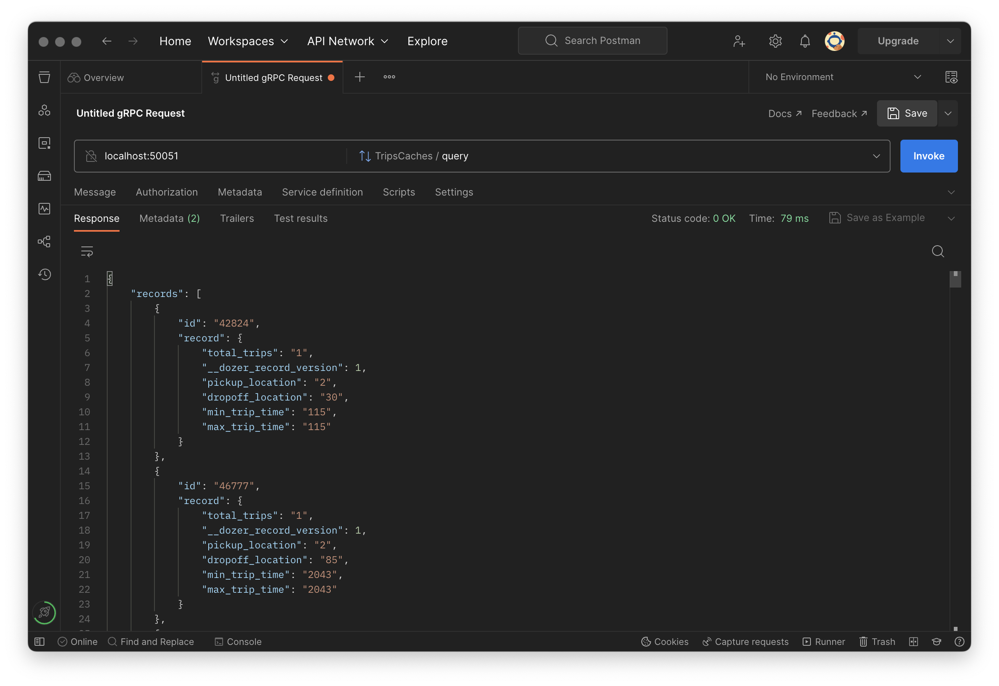

# Querying Data


In the previous steps, you already connected with data sources. Now let's learn how to query the data using gRPC APIs.

## 🔎 Querying Data using gRPC APIs

Dozer automatically produces gRPC APIs in two formats.

* **Common Query Format**: This format serves using common `Record` and `FieldDefinition` format with full type support. 
* **Typed Query Format**: It generates code for endpoint and provides statically typed APIs for `Endpoint`.

> *__NOTE__: this format of query requires the module grpcurl. You can install it  from its version in [grpcurl repository](https://github.com/fullstorydev/grpcurl).*


## List the gRPC services

First, let's check all the gRPC services, by using the command:


`grpcurl -plaintext localhost:50051 `

In terminal, will be displayed the full list, which is similar to this one:

```
listdozer.auth.AuthGrpcService
dozer.common.CommonGrpcService
dozer.generated.trips_cache.TripsCaches
dozer.health.HealthGrpcService
grpc.reflection.v1alpha.ServerReflection
```


We will use  `dozer.common.CommonGrpcService` in the next sessions, in making a query in Dozer.


### Example 1: count in Common Query Format

In our dataset, one of the endpoints we have is called `trips_cache`. Let's count all the number of entries in this endpoint. The query has the parameters:
* the endpoint, for example `trips_cache`, 
* the gRPC service, which is `dozer.common.CommonGrpcService/count`

In the terminal, write the command:

```bash
grpcurl -d '{"endpoint": "trips_cache"}' \
    -plaintext localhost:50051 dozer.common.CommonGrpcService/count
```
    
you will get the number of entries, which in this case is 3782. 
    
    
```json
{
  "count": "3782"
}
```

### Example 2: query in Common Query Format

In this example, let's get the fields and a record in the endpoint `trips_cache`. We will format the query according the Common Query Format. The parameters in this query are:

* the endpoint, in this example `trips_cache`, 
* the `query` , in this example `{\"$limit\":1}` because we want to show only one record,
* the gRPC service is `dozer.common.CommonGrpcService/count`


To run this query, write in the terminal this command: 

```bash
grpcurl -d '{"endpoint": "trips_cache", "query": "{\"$limit\":1}"}' \
    -plaintext localhost:50051 dozer.common.CommonGrpcService/query
```

It will be displayed a single entry, which is similar to this example. Note, there are displayed the fields and one record.

    
```json
{
  "fields": [
    {
      "typ": "Int",
      "name": "pickup_location",
      "nullable": true
    },
    {
      "typ": "Int",
      "name": "dropoff_location",
      "nullable": true
    },
    {
      "typ": "Int",
      "name": "total_trips"
    },
    {
      "typ": "Int",
      "name": "min_trip_time",
      "nullable": true
    },
    {
      "typ": "Int",
      "name": "max_trip_time",
      "nullable": true
    }
  ],
  "records": [
    {
      "id": "3597",
      "record": {
        "values": [
          {
            "intValue": "43"
          },
          {
            "intValue": "230"
          },
          {
            "intValue": "1045"
          },
          {
            "intValue": "122"
          },
          {
            "intValue": "2713"
          }
        ],
        "version": 45
      }
    }
  ]
}
```

### Example 3: query with filter in Common Query Format

In this example, let's add a filter, by choosing a location of the trip. Again, we choose to show only one record.

* the endpoint, in this example `trips_cache`, 
* the `query` , in this example `{\"$limit\":1}` because we want to show only one record,
* the `filter` , which is `{\"pickup_location\": 211}` because we want to display one of the trips that has pickup location equals to 211,
* the gRPC service is `dozer.common.CommonGrpcService/count`


To run this query, write in the terminal the command: 

```bash
grpcurl -d '{"endpoint": "trips_cache", "query": "{\"$limit\":1, \"$filter\": {\"pickup_location\": 211}}"}' \
    -plaintext localhost:50051 dozer.common.CommonGrpcService/query
```


It will be displayed a single entry, which is similar to this one:

    
```json
{
  "fields": [
    {
      "typ": "Int",
      "name": "pickup_location",
      "nullable": true
    },
    {
      "typ": "Int",
      "name": "dropoff_location",
      "nullable": true
    },
    {
      "typ": "Int",
      "name": "total_trips"
    },
    {
      "typ": "Int",
      "name": "min_trip_time",
      "nullable": true
    },
    {
      "typ": "Int",
      "name": "max_trip_time",
      "nullable": true
    }
  ],
  "records": [
    {
      "id": "3365",
      "record": {
        "values": [
          {
            "intValue": "211"
          },
          {
            "intValue": "132"
          },
          {
            "intValue": "1112"
          },
          {
            "intValue": "1453"
          },
          {
            "intValue": "13830"
          }
        ],
        "version": 112
      }
    }
  ]
}
```

## Use gRPC API in Postman 


Alternatively, you can use Postman to view gRPC APIs with full reflection support. 




## 📚 Get Open API Documentation

In case you need the API documentation, Dozer provides it by using this command:

`curl -X POST  http://localhost:8080/trips/oapi`

The response will be the full documentation that Dozer generates and which might help in showing all the endpoints and parameters of the REST API.


