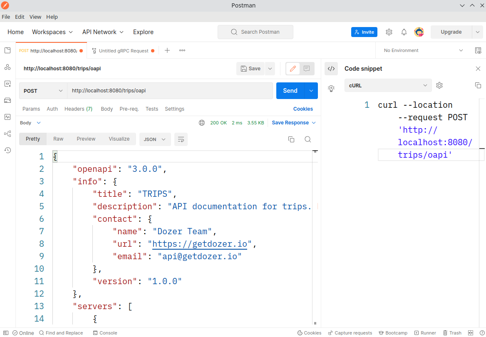

# Querying Data using REST APIs

Dozer automatically produces REST APIs including the documentation support. To make the query, let's use `curl`. The format of the request is:

```bash
curl -X POST  URL \
  --header 'Content-Type: application/json' \
  --data-raw QueryParameters
```

---

## Parameters

| Parameter | Description |
| -------- | -------- |
| **count**     | Counts the number of entries in the endpoint.     |
| **query**   | Defines a specific content or action, based on parameters passed in the Post Request.    |
| **oapi**   | Generates Open API3 documentation.   |


---

## count Parameter

### Description

The *count* parameter of counts the number of entries that match the specified endpoint. The count parameter can be useful when specifying data collections or for getting statistical information. 

### Behavior

* It appends at the end of the URL, in the format `URL/count`
* Returns the response in the JSON format :
```json
[
  {"count": " "},
]  
```

---

## query Parameter

### Description
The *query* parameter is defined by a set of body parameters attached to the URL in the cURL call. Each of the components of the query, is a body parameter, that helps define specific content or actions based on the data being passed.

### Behavior

* It appends at the end of the URL, in the format
 `curl -X POST  http://localhost:8080/endpoint/query` .
* Returns the result with the fields and the values that fulfill the query. The result is a JSON, similar to:
```json
[
  {"field":"value"},
]
```

### Parameters

`$limit` *integer*  *Optional*
The number limit specifies the number of resources that a single response contains.
  
`$filter` *string*  *Optional*
Field and value to filter items in a resource collection to return a subset of resources in a response.

`$order_by` *string*  *Optional*
Field by which will be ordered the result in the response.


**Example: display only 3 entries, using REST APIs**

In this example, let's show only 3 entries, by making a curl command. It has the parameters:

* the POST request,
* the URL of the REST API
* the header format
* and the data-row, in this example we limit it to 3 rows.


In the terminal, you can try to give this command:

```bash
curl -X POST  http://localhost:8080/trips/query \
  --header 'Content-Type: application/json' \
  --data-raw '{"$limit":3}'
```

The result is some data similar to this one:

```json
[{"pickup_location":43,"dropoff_location":230,"total_trips":1045,"min_trip_time":122,"max_trip_time":2713,"__dozer_record_id":3597,"__dozer_record_version":45},
{"pickup_location":161,"dropoff_location":1,"total_trips":1091,"min_trip_time":1437,"max_trip_time":11061,"__dozer_record_id":3369,"__dozer_record_version":91},
{"pickup_location":143,"dropoff_location":132,"total_trips":1022,"min_trip_time":1641,"max_trip_time":7694,"__dozer_record_id":3711,"__dozer_record_version":22}]
```


**Example: query with filter, using REST APIs**

Now let's add a filter, choosing a min_trip_time equals 150. The parameters in this example are:

* the POST request,
* the URL of the REST API
* the header format
* and the data-row, in this example we limit it to 3 rows and add filter `"min_trip_time": 150`.

In the terminal, write the command:

```bash
curl -X POST  http://localhost:8080/trips/query \
  --header 'Content-Type: application/json' \
  --data-raw '{"$filter": {"min_trip_time": 150}, "$limit":3}'
```
  
 The result displayed are three records, similar to these:
 
 ```json
[{"pickup_location":211,"dropoff_location":113,"total_trips":2247,"min_trip_time":150,"max_trip_time":5187,"__dozer_record_id":1715,"__dozer_record_version":1247},
{"pickup_location":179,"dropoff_location":146,"total_trips":1306,"min_trip_time":150,"max_trip_time":3160,"__dozer_record_id":2934,"__dozer_record_version":306},
{"pickup_location":135,"dropoff_location":95,"total_trips":3442,"min_trip_time":150,"max_trip_time":5706,"__dozer_record_id":676,"__dozer_record_version":2442}]
 ```


---

## oapi Parameter

### Description
The *oapi* parameter shows the API Documentation, and Dozer provides it by making a Post request in cURL.

### Behavior

* It appends at the end of the URL, in the format:

 `curl -X POST  http://localhost:8080/trips/oapi`.
* Returns the API Documentation. 


The response will be the full documentation that Dozer generates and which might help in showing all the endpoints and parameters of the REST API.

## Use Postman to test the REST API

Postman is a scalable API testing tool, which you can use to view gRPC APIs with full reflection support. 
In Postman, create a new POST request, and choose the host and the port of your API. In the right pane, you can see the cURL command for the query you are making. See the figure of the example of making a query using REST API.

