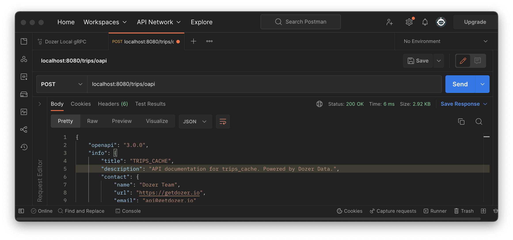

# Querying Data


In the previous steps, you already connected with data sources. Now let's learn how to query the data. Dozer provides several ways to make queries, and we'll go over them here.

## Making a query

In each case, we will use the example provided in the [sample configuration](https://getdozer.io/docs/configuration). 
Dozer provides two different ways to make a query:
* Using gRPC APIs
* Using REST APIs

Let's explore in details each of them.

## 🔎 Querying Data using gRPC APIs

Dozer automatically produces gRPC APIs in two formats.

* **Common Query Format**: This format serves using common `Record` and `FieldDefinition` format with full type support. 
* **Typed Query Format**: It generates code for endpoint and provides statically typed APIs for `Endpoint`.

Note: this format of query requires the module grpcurl. You can install it  from its version in [grpcurl repository](https://github.com/fullstorydev/grpcurl).


## List the gRPC services

First, let's check all the gRPC services, by using the command:


`grpcurl -plaintext localhost:50051 `

In terminal, will be displayed the full list, which is similar to this one:

```
listdozer.auth.AuthGrpcService
dozer.common.CommonGrpcService
dozer.generated.trips_cache.TripsCaches
dozer.health.HealthGrpcService
grpc.reflection.v1alpha.ServerReflection
```


We will use  `dozer.common.CommonGrpcService` in the next sessions, in making a query in Dozer.


## Example 1: count in Common Query Format

In our dataset, one of the endpoints we have is called `trips_cache`. Let's count all the number of entries in this endpoint. The query has the parameters:
* the endpoint, for example `trips_cache`, 
* the gRPC service, which is `dozer.common.CommonGrpcService/count`

In the terminal, write the command:

```
grpcurl -d '{"endpoint": "trips_cache"}' \
    -plaintext localhost:50051 dozer.common.CommonGrpcService/count
```
    
you will get the number of entries, which in this case is 3782. 
    
    
```
{
  "count": "3782"
}
```

## Example 2: query in Common Query Format

In this example, let's get the fields and a record in the endpoint `trips_cache`. We will format the query according the Common Query Format. The parameters in this query are:

* the endpoint, in this example `trips_cache`, 
* the `query` , in this example `{\"$limit\":1}` because we want to show only one record,
* the gRPC service is `dozer.common.CommonGrpcService/count`


To run this query, write in the terminal this command: 

```
grpcurl -d '{"endpoint": "trips_cache", "query": "{\"$limit\":1}"}' \
    -plaintext localhost:50051 dozer.common.CommonGrpcService/query
```

It will be displayed a single entry, which is similar to this example. Note, there are displayed the fields and one record.

    
```
{
  "fields": [
    {
      "typ": "Int",
      "name": "pickup_location",
      "nullable": true
    },
    {
      "typ": "Int",
      "name": "dropoff_location",
      "nullable": true
    },
    {
      "typ": "Int",
      "name": "total_trips"
    },
    {
      "typ": "Int",
      "name": "min_trip_time",
      "nullable": true
    },
    {
      "typ": "Int",
      "name": "max_trip_time",
      "nullable": true
    }
  ],
  "records": [
    {
      "id": "3597",
      "record": {
        "values": [
          {
            "intValue": "43"
          },
          {
            "intValue": "230"
          },
          {
            "intValue": "1045"
          },
          {
            "intValue": "122"
          },
          {
            "intValue": "2713"
          }
        ],
        "version": 45
      }
    }
  ]
}
```

## Example 3: query with filter in Common Query Format

In this example, let's add a filter, by choosing a location of the trip. Again, we choose to show only one record.

* the endpoint, in this example `trips_cache`, 
* the `query` , in this example `{\"$limit\":1}` because we want to show only one record,
* the `filter` , which is `{\"pickup_location\": 211}` because we want to display one of the trips that has pickup location equals to 211,
* the gRPC service is `dozer.common.CommonGrpcService/count`


To run this query, write in the terminal the command: 

```
grpcurl -d '{"endpoint": "trips_cache", "query": "{\"$limit\":1, \"$filter\": {\"pickup_location\": 211}}"}' \
    -plaintext localhost:50051 dozer.common.CommonGrpcService/query
```


It will be displayed a single entry, which is similar to this one:

    
```
{
  "fields": [
    {
      "typ": "Int",
      "name": "pickup_location",
      "nullable": true
    },
    {
      "typ": "Int",
      "name": "dropoff_location",
      "nullable": true
    },
    {
      "typ": "Int",
      "name": "total_trips"
    },
    {
      "typ": "Int",
      "name": "min_trip_time",
      "nullable": true
    },
    {
      "typ": "Int",
      "name": "max_trip_time",
      "nullable": true
    }
  ],
  "records": [
    {
      "id": "3365",
      "record": {
        "values": [
          {
            "intValue": "211"
          },
          {
            "intValue": "132"
          },
          {
            "intValue": "1112"
          },
          {
            "intValue": "1453"
          },
          {
            "intValue": "13830"
          }
        ],
        "version": 112
      }
    }
  ]
}
```

## Use gRPC API in Postman 


Alternatively, you can use Postman to view gRPC APIs with full reflection support. 


## 🔎 Querying Data using REST APIs

Dozer automatically produces REST APIs including the documentation support. 
Let's use the same data source, but this time making query by using `curl`. 


## Example 4: display only 3 entries, using REST APIs

In this example, let's show only 3 entries, by making a curl command. It has the parameters:

* the POST request,
* the URL of the REST API
* the header format
* and the data-row, in this example we limit it in 3 rows.


In the terminal, you can try to give this command:

```
curl -X POST  http://localhost:8080/trips/query \
  --header 'Content-Type: application/json' \
  --data-raw '{"$limit":3}'
```

The result is some data similar to this one:

```
[{"pickup_location":43,"dropoff_location":230,"total_trips":1045,"min_trip_time":122,"max_trip_time":2713,"__dozer_record_id":3597,"__dozer_record_version":45},
{"pickup_location":161,"dropoff_location":1,"total_trips":1091,"min_trip_time":1437,"max_trip_time":11061,"__dozer_record_id":3369,"__dozer_record_version":91},
{"pickup_location":143,"dropoff_location":132,"total_trips":1022,"min_trip_time":1641,"max_trip_time":7694,"__dozer_record_id":3711,"__dozer_record_version":22}]
```


## Example 5: query with filter, using REST APIs

Now let's add a filter, choosing a min_trip_time equals 150. The parameters in this example are:

* the POST request,
* the URL of the REST API
* the header format
* and the data-row, in this example we limit it in 3 rows and add filter `"min_trip_time": 150`.

In the terminal, write the command:

```
curl -X POST  http://localhost:8080/trips/query \
  --header 'Content-Type: application/json' \
  --data-raw '{"$filter": {"min_trip_time": 150}, "$limit":3}'
```
  
 The result displayed are three records, similar to these:
 
 ```
[{"pickup_location":211,"dropoff_location":113,"total_trips":2247,"min_trip_time":150,"max_trip_time":5187,"__dozer_record_id":1715,"__dozer_record_version":1247},
{"pickup_location":179,"dropoff_location":146,"total_trips":1306,"min_trip_time":150,"max_trip_time":3160,"__dozer_record_id":2934,"__dozer_record_version":306},
{"pickup_location":135,"dropoff_location":95,"total_trips":3442,"min_trip_time":150,"max_trip_time":5706,"__dozer_record_id":676,"__dozer_record_version":2442}]
 
 ```

 
## Test API using Postman

Alternatively, you can import all the above curl requests to Postman.



## 📚 Get Open API Documentation

In case you need the API documentation, Dozer provides it by using this command:

`curl -X POST  http://localhost:8080/trips/oapi`

The response will be the full documentation that Dozer generates and which might help in showing all the endpoints and parameters of the REST API.


###### tags: `Dozer` `query` `curl` `grpcurl` `API`
